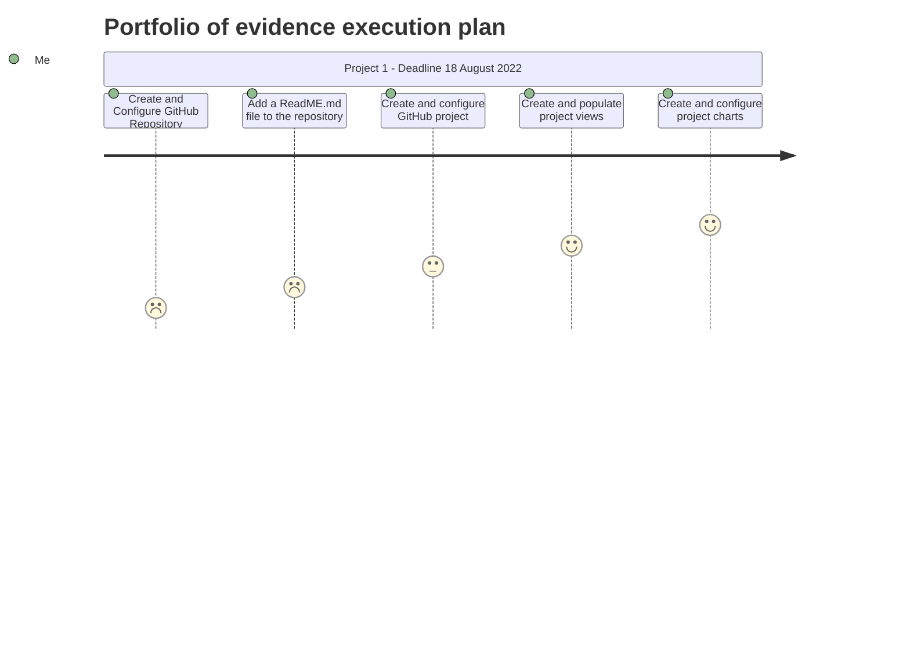

# CMPG323 - Overview - 36309915
Repository for CMPG323 - 36309915
This is a overview repository for the Portfolio of Evidence we need to submit at the end of the semester for CMPG 323

## The following five repositories will be created: 

### 1. Project 1: – Agile & Scrum
      This Repository will be named: CMPG-323-Project1-36309915

### 2.  Project 2: – API
       This Repository will be named: CMPG-323-Project2-36309915

### 3.  Project 3: – Standards and Good Practices: Web Application
       This Repository will be named: CMPG-323-Project3-36309915
 
### 4.  Project 4: – RPA & Testing
       This Repository will be named: CMPG-323-Project4-36309915

### 5.  Project 5: – Reporting & Monitoring
       This Repository will be named: CMPG-323-Project5-36309915

### 6.  EXAM(POE): – Proof of Evidence
       This Repository will be named: CMPG-323-EXAM(POE)-36309915

# CMPG 323 - SPEC & REQUIREMENTS - PORTFOLIO OF EVIDENCE (POE) EXAM

# BRANCHING

According to my research, there are 4 main types of branching strategies:

1. Trunk Based Development
2. Release Branching
3. Feature Branching
4. Story or Task Branching
	
Because we are doing agile & scrum, and user-stories is very popular using this methodology - I have decided on using Story/Task Branching for my git project.

I will therefore have 4 main braches per Repository:
1. Story XYZ - this will be the first branch used when writing code. All code will first be pushed in here.
2. Integration - this branch will be for code that has passed all tests and are ready to be pushed to QA
3. QA - This is code that have passed the QA stage and is ready to be pushed to staging
4. Staging - This code is ready to be pushed to production.

# .GITIGNORE FILE

In the gitignore file, you put all the files you want to omit when comitting/pushing to git. 

This includes files like:
1. Log files
2. Files with sensitive information like API keys/credentials
3. System generated files like dist folders
4. dependencies that can be downloaded from package manager

In order to ensure that the person cloning your repository knows which dependancies to download, i will include a requirements.txt file with all required packages on. 

# STORAGE OF CREDENTIALS AND SENSITIVE INFORMATION

According to Spectral, the following is best practises to keep in mind when dealing with sensitive information:

1. Never store credentials and sensitive data on GitHub
2. Disable forking
3. Disable visibility changes
4. Validate your GitHub applications
5. Enforce 2-factor authentication
6. Implement SSO (GitHub enterprise only)
7. Limit access to allowed IP addresses
8. Tightly manage external contributor permissions
9. Revoke permissions in a timely manner
10. Require commit signing
11. Enforce code review before commit
12. Add a Security.md file
13. Rotate SSH keys and Personal Access Tokens
14. Audit all code uploaded to GitHub
15. Review your Github audit logs for suspicious activity
16. Enable alerts for vulnerable dependencies
17. Employ automated secret scanning at pre-commit
18. Clear your GitHub history
19. Enable git branch protection
20. Add sensitive files to .gitignore
21. Employ a “secrets vault” service

After researching this, I think I will have environment variables for all sensitive information in my project. 

I will then also create a security.md file in my repository that will have the process description and config files forming part of the project that will setup everything correctly. When using docker containers, you can also store the environment variables easily inside the container, without giving access away.

# SOURCES

https://www.freecodecamp.org/news/how-to-add-diagrams-to-github-readme/
https://www.agileconnection.com/article/picking-right-branch-merge-strategy
https://www.pluralsight.com/guides/how-to-use-gitignore-file
https://spectralops.io/resources/how-to-choose-a-secret-scanning-solution-to-protect-credentials-in-your-code/
https://withblue.ink/2021/05/07/storing-secrets-and-passwords-in-git-is-bad.html
