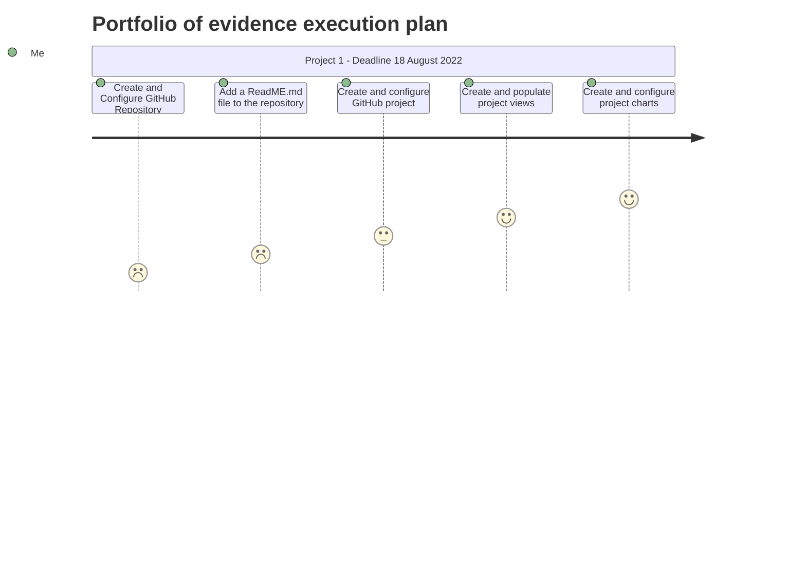

# CMPG323 - Overview - 36309915
Repository for CMPG323 - 36309915
This is a overview repository for the Portfolio of Evidence we need to submit at the end of the semester for CMPG 323

## The following five repositories will be created: 

### 1. Project 1: – Agile & Scrum
      This Repository will be named: CMPG-323-Project1-36309915

### 2.  Project 2: – API
       This Repository will be named: CMPG-323-Project2-36309915

### 3.  Project 3: – Standards and Good Practices: Web Application
       This Repository will be named: CMPG-323-Project3-36309915
 
### 4.  Project 4: – RPA & Testing
       This Repository will be named: CMPG-323-Project4-36309915

### 5.  Project 5: – Reporting & Monitoring
       This Repository will be named: CMPG-323-Project5-36309915

### 6.  EXAM(POE): – Proof of Evidence
       This Repository will be named: CMPG-323-EXAM(POE)-36309915

# CMPG 323 - SPEC & REQUIREMENTS - PORTFOLIO OF EVIDENCE (POE) EXAM

# BRANCHING

According to my research, there are 4 main types of branching strategies:

1. Trunk Based Development
2. Release Branching
3. Feature Branching
4. Story or Task Branching
	
Because we are doing agile & scrum, and user-stories is very popular using this methodology - I have decided on using Story/Task Branching for my git project.

I will therefore have 4 main braches per Repository:
1. Story XYZ - this will be the first branch used when writing code. All code will first be pushed in here.
2. Integration - this branch will be for code that has passed all tests and are ready to be pushed to QA
3. QA - This is code that have passed the QA stage and is ready to be pushed to staging
4. Staging - This code is ready to be pushed to production.
